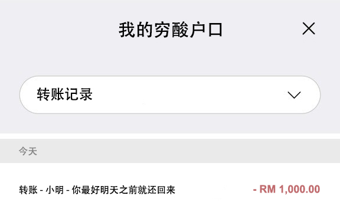
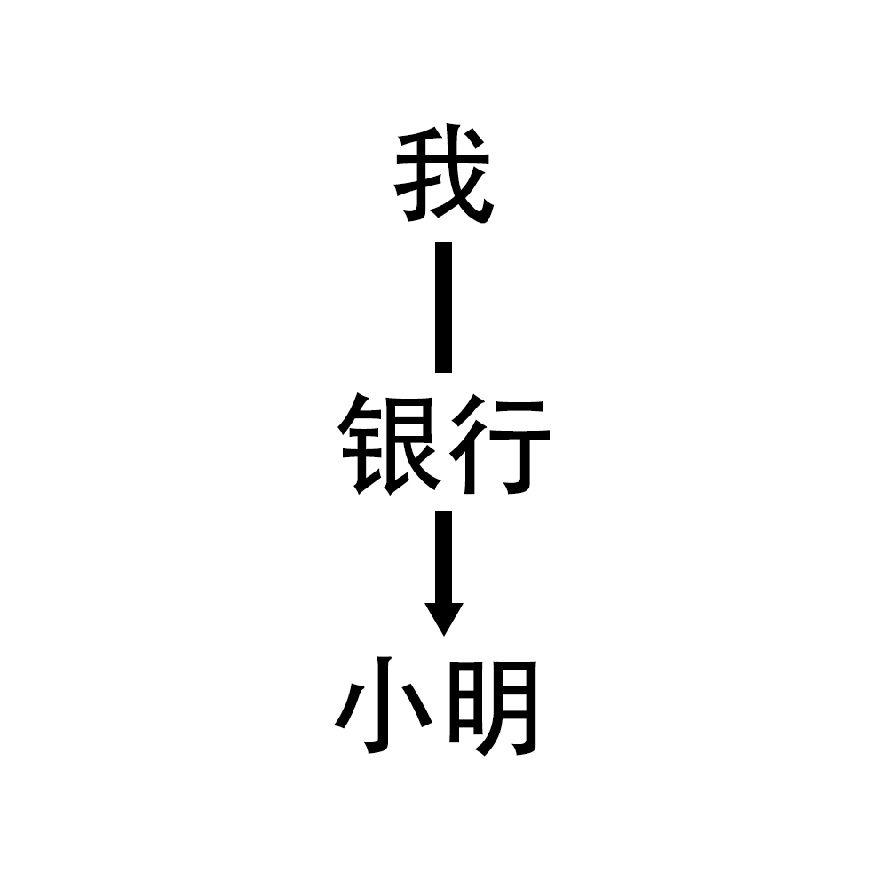

# 区块链到底是什么鬼东西？

> 区块链到底是什么东西嘛？有可以讲人话的人吗？

基本上如果你是个有正常社交生活的人，多少都应该听过区块链这个东西。Bitcoin *（比特币）*，Ethereum *（以太币）*，NFT 应该多少都听过吧？这些是区块链的应用，是表现形式的一种。类似的解释大概就是手机 App 跟手机的关系，手机是区块链的话，比特币就只是你手机里的其中一个 App 。
 

要了解区块链，首先我们要理解区块链是干嘛的。它被创造的目的是什么呢？它要解决什么问题呢？
 

打个比方，我的好友小明向我借了 1000 块钱。那我现在有几种方式打钱给他：
1. 现金
2. 手机支付 / e-wallet 转账
3. 通过银行转账

鉴于像我这样的穷鬼都不会把 1000 块现金带在身上，我大多数会选择通过银行转账。
 

那就带出我们今天的问题 - **银行转账**

 

> 银行转账是问题？你是不是吃 nasi lemak 吃傻了哦你？

一般通过银行转账的步骤是怎样的呢？

1. 登录网站
2. 输入小明的户口号码
3. 输入金额
4. 输入验证码
5. 转帐成功

 

然后在账户明细就会出现一个类似以下的画面。
 

那所谓的转账就已经完成了，小明就可以去他的银行取钱或直接转给下一个人了。
 

 

## 这样看起来既普通又正常的转账，怎么就有问题了呢？
---
 

那首先我们就要了解转账背后的基础逻辑。为了能顺利转账 1000 块，有什么先决条件。

1. 你至少要有银行户口
2. 户口里至少要有 1000 块
3. 你要知道对方的银行 + 户口号码

在区块链里面，我们要聊的问题当然就是在银行系统。如果你有开发软件的经验，你就会知道你户口里有多少钱取决于银行系统的 database 里面存的一行数字。相信大家年轻的时候都有幻想过在银行工作的话，我就把全国的银行户口里面转 1 分钱到我的户口里面就发达了。 *（嗯，没错，区块链防的就是你这种人）* 当然，这种幻想一般随着你真正进入银行工作而幻灭。
 

如果你还没有看到问题在哪里，请参考一下图片。
 

 

综上所述，你 / 我银行户口里有多少钱完全就是银行说了算。 *（尤其是现在连个簿子都没有，你上哪说理去）* 
有没有转帐成功，还是银行说了算。
 

 

==这时候你可能会问：“那有没有一丢丢可能，其实我早就是家财万贯了呢？就是那些黑心的银行每天就在我的户口里偷偷扣一角钱。”==

<strong>没有可能哈，不要在这里做梦</strong>
 

 

其实讲这么多要表达的就是，银行系统背后是人为操作的。那既然是人为操作，就会有发生人为因素导致的错误，不管是有意还是无意的。随着信息数码化，这类的人为失误当然有办法减少。但这也引发了数码化的问题，比方说黑客、内部职员看我比较帅不爽我啊之类的。
 

 

## 可是区块链就能解决这些问题吗？

 

一个字带过，能。
